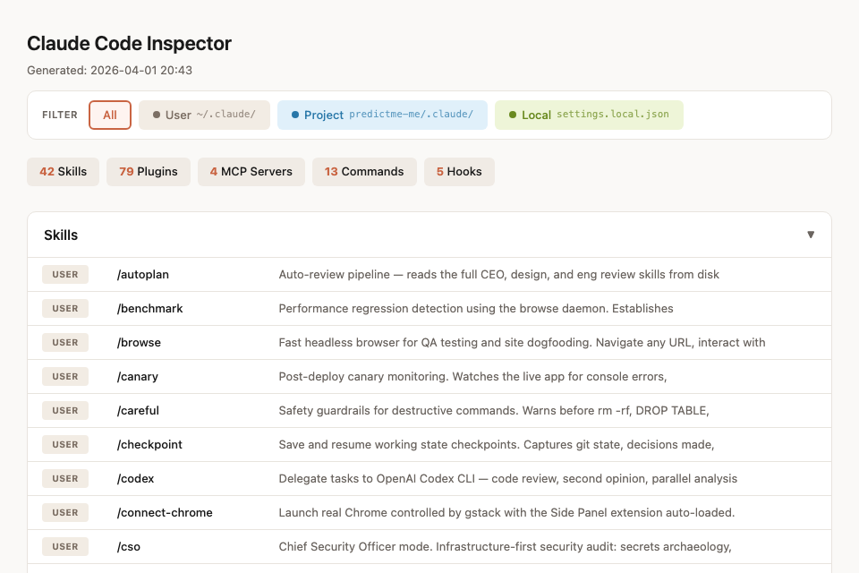
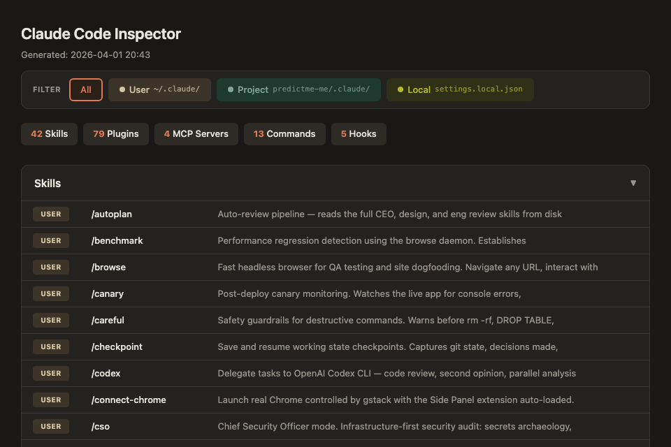
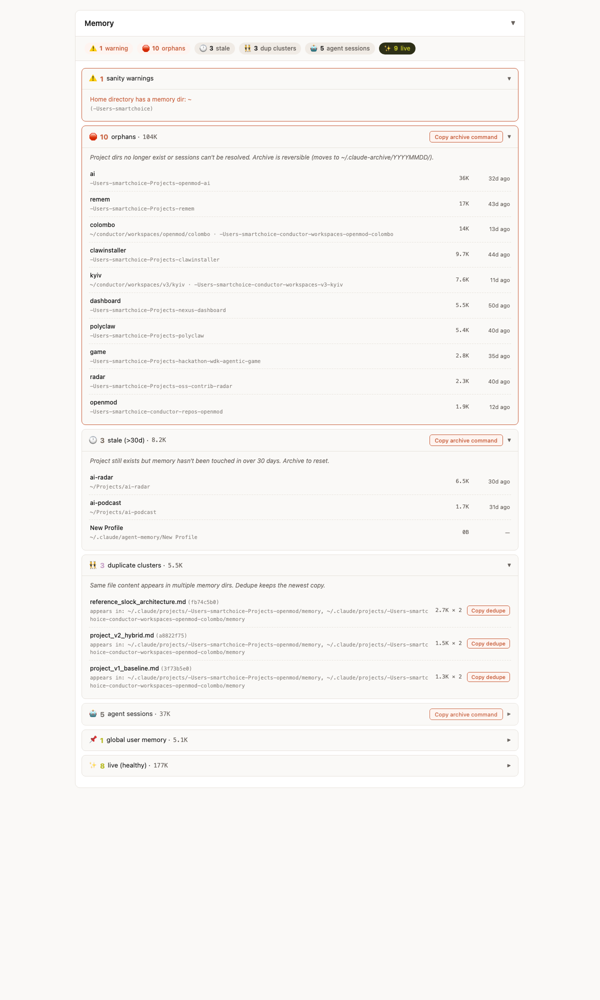

# cc-inspect

A Claude Code skill that instantly shows all your installed skills, plugins, MCP servers, commands, and hooks in a browser dashboard.

**English** | [繁體中文](README.zh-TW.md)





## Features

- **Scope-aware**: shows User (`~/.claude/`), Project (`.claude/`), and Local (`settings.local.json`) layers
- **Clickable scope filter** — badge counts update dynamically
- **Collapsible sections** for Skills, Plugins, MCP Servers, Commands, Hooks, Memory
- **Memory hygiene audit** — flags stale, orphaned, and duplicated memory directories
- **Auto-detects** project scope from current working directory
- **Light/dark mode** follows system preference
- **Zero dependencies** — pure bash + python3, generates a self-contained HTML file

## Install

```bash
git clone https://github.com/howardpen9/cc-inspect.git
cd cc-inspect
mkdir -p ~/.claude/skills/cc-inspector
cp inspect.sh SKILL.md ~/.claude/skills/cc-inspector/
chmod +x ~/.claude/skills/cc-inspector/inspect.sh
```

## Usage

In any Claude Code conversation:

```
/inspect
```

A browser tab opens with your full Claude Code ecosystem dashboard.

## How it works

1. `inspect.sh` scans `~/.claude/` and the current project's `.claude/` directory
2. Collects skills, plugins, MCP servers, commands, and hooks from all scopes
3. Generates a self-contained HTML file at `/tmp/cc-inspector.html`
4. Opens it in the default browser via `open`

## Requirements

- macOS (uses `open` command; Linux users can change to `xdg-open`)
- Python 3 (for JSON parsing and YAML frontmatter extraction)
- Claude Code CLI

## What it scans

| Source | Path | Scope |
|--------|------|-------|
| Skills | `~/.claude/skills/` | User |
| Skills | `<project>/.claude/skills/` | Project |
| Plugins | `~/.claude/plugins/marketplaces/` | User |
| MCP Servers | `settings.json` → `mcpServers` | User / Project / Local |
| Commands | `~/.claude/commands/` | User |
| Commands | `<project>/.claude/commands/` | Project |
| Hooks | `settings.json` → `hooks` | User / Project / Local |
| Memory | `~/.claude/CLAUDE.md`, `~/.claude/projects/<encoded>/memory/*.md`, `~/.claude/agent-memory/*` | User |

## Memory Hygiene

Claude Code writes auto-memory into per-project folders under `~/.claude/projects/<encoded>/memory/`. After a few months of everyday use, that tree easily grows to 20+ directories — including entries for projects you deleted, renamed, or only touched once. cc-inspect's Memory section is a cleanup recommender: it groups what's there by action needed and gives you copy-to-clipboard archive commands.

<picture>
  <source media="(prefers-color-scheme: dark)" srcset="screenshot-memory-dark.png">
  
</picture>

Instead of a file browser, you get grouped recommendations:

| Group | What it contains | Action |
|-------|------------------|--------|
| Sanity warnings | Anomalies like memory under the home directory | Awareness only |
| Orphans | Source project directory no longer exists, or no session `.jsonl` to verify it | Copy archive command |
| Stale | All MD files older than 30 days, project still alive | Copy archive command |
| Duplicates | MD5-matched content across different memory dirs | Per-cluster dedupe command (keeps newest) |
| Agent sessions | `.slock/agents/<uuid>` — transient per-agent memory | Copy bulk archive command |
| Live | Healthy dirs with recent activity (collapsed by default) | None |

Archive commands move directories into `~/.claude-archive/YYYYMMDD/` so cleanup is reversible — nothing is deleted.

Locations are decoded from the ground-truth `cwd` field in session `.jsonl` files rather than naive path-to-slash reversal, so folders with real dashes or unusual characters resolve correctly.

The view only reports locations, sizes, and timestamps. File contents are hashed for duplicate detection but never read into the dashboard.

## License

MIT
